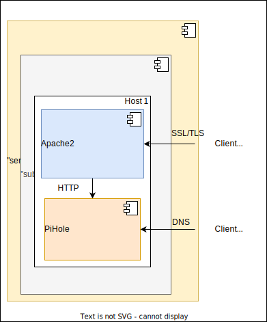

# Ansible playbook: labocbz.deploy_pihole


## Description


An Ansible playbook to install and configure PiHole on a server based on Debian/Ubuntu.

This Ansible playbook is designed for deploying Pi-hole, a powerful DNS and ad-blocking service. Pi-hole not only blocks unwanted ads but also provides a range of configuration options for DNS settings.

The playbook leverages predefined roles, with specific details explained in the 'install_pihole' role, to simplify the installation and configuration process. With this playbook, you can customize various aspects of Pi-hole, including setting an admin web interface password, defining CNAME and AAAA records, and configuring basic parameters.

The playbook is structured to be flexible, allowing you to tailor Pi-hole deployments to your specific needs. Whether you want to enhance your network's security, reduce unwanted advertisements, or have fine-grained control over DNS settings, this playbook streamlines the process.

Using Ansible alongside this playbook makes deploying Pi-hole consistent and efficient across your infrastructure. It ensures that your DNS and ad-blocking service is set up with your preferred configurations, enhancing network privacy and performance.

The inclusion of an Ansible playbook simplifies the entire process, from installing Docker to advanced configuration of Pihole, and optionally, setting up Apache2 as a local reverse proxy. This advanced Apache2 configuration provides features such as SSL, Authentication, LDAP, Quality of Service (QOS), and a web application firewall (WAF). By combining these elements, this Ansible playbook aims to streamline container management while ensuring a high level of security and compliance with best practices.

## Deployment diagramm



Here is a potential deployment scenario using the playbook. We can observe that Pihole is installed on the same host as Apache2, which then functions as an SSL/TLS reverse proxy, WAF, QoS, Auth, etc. Pihole is primarily used for administering a DNS server, which clioent connect through the default port for DNS and cannot be included in the reverse proxy.

## Tests and simulations

### Basics

You have to run multiples tests. *tests with an # are mandatory*

```MARKDOWN
# syntax
# converge
# idempotence
# verify
side_effect
```

Executing theses test in this order is called a "scenario" and Molecule can handle them.

Molecule use Ansible and pre configured playbook to create containers, prepare them, converge (run the playbook) and verify its execution.
You can manage multiples scenario with multiples tests in order to get a 100% code coverage.

This playbook contains a ./tests folder. In this folder you can use the inventory or the tower folder to create a simualtion of a real inventory and a real AWX / Tower job execution.

### Command reminder

```SHELL
# Check your YAML syntax
yamllint -c ./.yamllint .

# Check your Ansible syntax and code security
ansible-lint --config=./.ansible-lint .

# Execute and test your playbook
molecule create
molecule list
molecule converge
molecule verify
molecule destroy

# Execute all previous task in one single command
molecule test
```

## Installation

To install this playbook, just copy/import this playbook or raw file into your fresh playbook repository or call it with the "include_playbook/import_playbook" module.

## Usage

### Vars

```YAML
# From inventory
---

```

```YAML
# From AWX / Tower
---

```

## Architectural Decisions Records

Here you can put your change to keep a trace of your work and decisions.

### 2023-09-23: First Init

* First init of this playbook with the bootstrap_playbook playbook by Lord Robin Crombez
* Playbook deploy PiHole and configure CNAME, AAAA and severals options, see role documentation
* Its possible to set multiple PiHole and build a cascade DNS cluster / service (externalise vars for CNAME and AAAA)

### 2023-10-06: New CICD, new Images

* New CI/CD scenario name
* Molecule now use remote Docker image by Lord Robin Crombez
* Molecule now use custom Docker image in CI/CD by env vars
* New CICD with needs and optimization

### 2023-12-18: System Users

* System users handled
* Added log rotation for Apache2
* Fix default install

### 2024-03-01: Remastered

* Imported new CICD
* Rework global on readme
* Rename of vars __

### 2024-05-19: New CI

* Added Markdown lint to the CICD
* Rework all Docker images
* Change CICD vars convention
* New workers
* Removed all automation based on branch

## Authors

* Lord Robin Crombez

## Sources

* [Ansible playbook documentation](https://docs.ansible.com/ansible/latest/playbook_guide/playbooks_reuse_playbooks.html)
* [Ansible Molecule documentation](https://molecule.readthedocs.io/)
* [labocbz.install_pihole](https://github.com/CBZ-D-velop/Ansible-Role-Labocbz-Install-PiHole.git)
